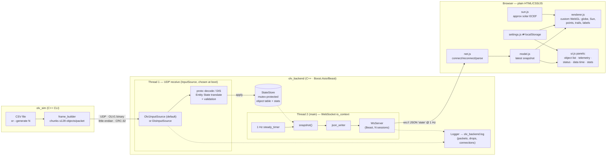

# Orbital LOS Viewer — Implementation Plan

Version: 0.1.0 · Date: 2026-07-01 · Status: **approved for implementation**

This is the plan-of-record. Interfaces defined here (and in `docs/PROTOCOL_UDP.md`,
`docs/PROTOCOL_WS.md`, and the checked-in C++ headers) are frozen before parallel
implementation begins. Deviations require updating this document.

---

## 1. Overview

Orbital LOS Viewer visualizes one primary satellite in Earth orbit plus up to
5,000 tracked objects (debris, stars, comets, other satellites, hot ground
objects) in a browser. All coordinates are ECEF meters. Data flows:

- **Simulator** (C++) replays CSV files (or synthesizes load-test data) as
  custom binary UDP packets at a configurable rate (target 1 Hz); it can also
  emit IEEE 1278.1 DIS Entity State PDUs instead (`--protocol dis`).
- **Backend** (C++17/20, Boost.Asio + Boost.Beast) receives UDP on a dedicated
  thread, validates and decodes packets, maintains the latest world state, and
  broadcasts a JSON snapshot at 1 Hz over WebSocket from a second thread. The
  intake side is a pluggable boot-time strategy (`InputSource`): the default
  OLV1 binary protocol, or DIS Entity State PDU ingestion (`--input-mode dis`,
  docs/PROTOCOL_DIS.md, docs/features/FEATURE_INPUT_SOURCES.md).
- **Frontend** (plain HTML/CSS/JS, no frameworks, no runtime internet) renders
  a simplified Earth globe, the satellite, an approximate Sun, and all objects
  with a custom minimal WebGL renderer, plus UI panels and a settings menu.

Design bias: **simplicity over maximum performance**. 5,000 objects at 1 Hz is
well within reach of one `GL_POINTS` draw call and a ~500 KB JSON message per
second on localhost/LAN.

## 2. Architecture



### Threading & synchronization (backend)

- **Thread 1 (UDP):** owned by the boot-selected `InputSource` (exactly one
  per process, `Config::input_mode`): its own `io_context`,
  `async_receive_from` loop. The default `Olv1InputSource`: each datagram
  runs `proto::decode` (structural + CRC + finiteness/range checks) →
  `StateStore::apply` (sequence staleness check, merge objects by ID).
  `DisInputSource` (`--input-mode dis`) instead translates IEEE 1278.1 DIS
  Entity State PDUs into the same `StateStore` calls (docs/PROTOCOL_DIS.md).
  Either way, invalid packets are counted + logged and dropped, and both
  implementations feed the identical `countReceived`/`countDropped`/`apply`
  API, so stats mean the same thing in both modes.
- **Thread 2 (main/WS):** one `io_context` running the Beast acceptor, all
  WebSocket sessions, and a 1 Hz `steady_timer`. On each tick: take a
  `Snapshot` copy from `StateStore` (prunes objects not refreshed within the
  expiry window, default 15 s), serialize once to a `shared_ptr<const string>`,
  enqueue to every session (per-session outbox; a slow client that backs up
  past 5 pending frames has frames dropped, not the connection).
- **Shared state:** exactly one mutex, inside `StateStore`. Sessions live only
  on thread 2, so they need no locking. Clean shutdown via `asio::signal_set`
  (SIGINT/SIGTERM) stopping both contexts.

Object updates larger than one packet are **not** fragment-reassembled: each
packet independently refreshes the satellite state and merges its object chunk
into the table keyed by object ID. This makes the protocol loss-tolerant and
keeps the backend simple (see PROTOCOL_UDP.md).

## 3. Repository tree

```
.
├── CMakeLists.txt                  # top level: project, find_package, add_subdirectory(src/tools/test)
├── cmake/
│   ├── common.cmake                # shared toolchain/options/warnings/olv_proto setup
│   ├── open_dis_cpp.cmake          # locates installed open-dis-cpp (imported target)
│   └── tooling.cmake               # format / format-check / lint targets
├── README.md
├── LICENSE                         # MIT
├── THIRD_PARTY.md                  # dependency & license report
├── .clang-format / .clang-tidy / .editorconfig / .gitignore / .dockerignore
├── docs/
│   ├── PLAN.md                     # this file
│   ├── PROTOCOL_UDP.md             # binary wire format (normative)
│   ├── PROTOCOL_DIS.md             # DIS input mode: PDU subset & mapping (normative)
│   ├── PROTOCOL_WS.md              # WebSocket JSON format (normative)
│   ├── features/                   # per-feature design docs (input sources, sat view, sky)
│   └── SBOM.md                     # SBOM strategy & instructions
├── config/
│   ├── backend.toml                # commented example (olv_backend --config …)
│   └── simulator.toml              # commented example (olv_sim --config …)
├── include/olv/                    # backend headers (olv_backend)
│   ├── protocol.hpp                # single source of truth for wire format
│   ├── toml.hpp                    # first-party TOML-subset parser (shared)
│   ├── logger.hpp                  # thread-safe file logger + ISO-8601 utils
│   ├── state_store.hpp             # object table, stats, snapshot
│   ├── input_source.hpp            # intake strategy interface + boot-time factory
│   ├── olv1_input_source.hpp       # thread 1, OLV1 mode (default)
│   ├── dis_input_source.hpp        # thread 1, DIS mode (PROTOCOL_DIS.md)
│   ├── json_writer.hpp             # snapshot → WS JSON text
│   ├── ws_server.hpp               # Beast acceptor/sessions/broadcast timer
│   └── config.hpp                  # TOML config file + CLI parsing
├── src/                            # backend sources (*.cpp for the above + main.cpp)
│   └── CMakeLists.txt              # olv_core, olv_net, olv_backend
├── test/                           # backend unit tests (custom mini-framework)
│   ├── CMakeLists.txt              # olv_backend_tests + integration CTest
│   └── support/olv_test.hpp        # minimal shared C++ test framework
├── tools/
│   ├── CMakeLists.txt              # olv_ws_probe; add_subdirectory(simulator)
│   ├── ws_probe.cpp                # WS client used by the integration test
│   └── simulator/
│       ├── CMakeLists.txt          # standalone-configurable
│       ├── src/{main.cpp, csv_reader.*, frame_builder.*, dis_builder.*, generator.*, sim_config.*}
│       ├── data/example_mission.csv  # 60 s satellite pass + ~25 mixed objects
│       └── tests/
├── frontend/
│   ├── index.html
│   ├── config.toml                 # site defaults, fetched at startup
│   ├── css/style.css
│   ├── js/{main,net,model,ui,settings,toml,site_config,
│   │       renderer,camera,math3,sun}.js
│   └── tests/                      # node:test suites + validate_message.mjs
├── scripts/
│   ├── integration_test.sh         # sim → backend → ws_probe → JSON check
│   ├── serve_frontend.sh           # python3 -m http.server wrapper
│   ├── run_all.sh                  # backend + simulator + frontend, one command
│   ├── gen_sbom.py                 # CycloneDX SBOMs (backend + frontend)
│   └── make_example_csv.py         # regenerates the example CSV
└── containers/
    ├── Containerfile.cpp           # multi-stage; targets: backend, simulator
    ├── Containerfile.frontend      # static file server
    └── compose.yaml                # podman-compose / docker compose
```

**CMake layout:** the top-level `CMakeLists.txt` only sets up the project
(`cmake/common.cmake`), finds dependencies (Threads, Boost, open-dis-cpp) and adds
the `src/`, `tools/` and (when `OLV_BUILD_TESTS`) `test/` subdirectories; each
subdirectory lists its own sources and per-target options.

**Independent buildability:** the backend is the top-level project (`cmake -S .`);
`tools/simulator/CMakeLists.txt` carries an `if(NOT DEFINED PROJECT_NAME)`
standalone header so the simulator can also be configured in isolation
(`cmake -S tools/simulator -B build-sim`); the top level adds it as a subdirectory.

## 4. UDP protocol (summary — normative spec in PROTOCOL_UDP.md)

- Magic `'O','L','V','1'`, version 1, msg type 1 (`STATE_UPDATE`).
- All multi-byte fields **little-endian**; layout defined by byte offset, never
  by C struct overlay (portable, alignment-free).
- Header 56 B: magic, version, type, reserved flags, **sequence (per packet)**,
  satellite id, satellite ECEF pos (3×f64 m), velocity (3×f32 m/s),
  `object_count` (this packet, ≤128), `object_total` (this cycle, ≤5000).
- Object record 48 B: id (u32), type enum (u8: 1 debris, 2 star, 3 comet,
  4 satellite, 5 ground-hot), flags (u8: bit0 has-velocity, bit1 highlight),
  confidence (u8, 0–100), reserved (u8), pos 3×f64, vel 3×f32, intensity f32
  (Kelvin for ground-hot, magnitude for stars).
- Trailer: CRC-32 (IEEE 802.3) over all preceding bytes.
- Max packet 56 + 128×48 + 4 = **6,204 B** (may IP-fragment on Ethernet; fine
  for localhost/LAN; simulator `--chunk` can lower it below one MTU).
- Validation (drop + count + log): short/long datagram, bad magic/version/type,
  length mismatch vs count, count/total over limits, CRC mismatch, NaN/Inf,
  |coordinate| > 1e13 m, unknown object type, stale sequence (wraparound-safe
  `int32` comparison in `StateStore`).
- "All data arrives at current time" ⇒ no timestamp on the wire; the backend
  stamps receive time and reports it as `lastDataTime`.

## 5. WebSocket JSON (summary — normative spec in PROTOCOL_WS.md)

On connect: `{"type":"hello","protocolVersion":1,"serverTime":…,"broadcastHz":1,…}`.
Every second: a `state` message:

```json
{"type":"state","serverTime":"2026-07-01T12:34:56.789Z",
 "lastDataTime":"2026-07-01T12:34:56.500Z",
 "satellite":{"id":1,"seq":42,"pos":[x,y,z],"vel":[x,y,z]},
 "objects":[[id,cat,px,py,pz,vx,vy,vz,conf,intensity,flags], …],
 "stats":{"udpReceived":0,"udpAccepted":0,"udpDropped":0,"udpRateHz":0.0,
          "wsClients":1,"objectCount":0,"broadcastSeq":7}}
```

Objects are fixed 11-column rows (nulls for missing velocity) — ~45% smaller
than key/value objects at 5,000 entries (~450 KB/s/client; acceptable on LAN,
documented as a scaling limit). Positions rounded to 0.1 m, velocities 0.01 m/s.

## 6. Frontend design

**Rendering: custom minimal WebGL 1 renderer (no Three.js).** Rationale: the
scene is one sphere + graticule + one points draw + line trails + 2D-canvas
labels — a few hundred lines of focused GL. Three.js (~650 KB vendored) would
be justified only if we needed textures/models/postprocessing. Trade-off is
documented in §10; switching later is localized to `renderer.js`.

- Scene units: 1 unit = 1,000 km (`SCALE = 1e-6`); Earth radius 6.371.
- Earth: lat/lon sphere mesh, Lambert shading lit by the Sun direction +
  ambient floor, procedural blue coloring, 15° graticule lines. No textures
  (air-gap friendly).
- Sun: `sun.js` computes an approximate solar direction in ECEF from the
  client clock (low-precision almanac formula: ecliptic longitude → RA/dec →
  GMST rotation; ±~1° accuracy — fine per requirements). Rendered as a
  billboard disc at 150 units; also drives globe lighting.
- Objects: one `GL_POINTS` draw, preallocated arrays for 5,000; per-category
  colors/sizes; objects farther than 120 units (e.g. stars given as distant
  ECEF direction markers) are clamped onto a 120-unit celestial shell,
  preserving direction.
- Primary satellite: distinct marker + ring + 60 s velocity vector.
- Trails: per-id ring buffers appended at snapshot rate (1 Hz), drawn as
  age-faded `GL_LINES` when enabled; duration 0–60 s from settings.
- Labels: 2D overlay canvas; when enabled, nearest 200 objects + satellite +
  selection (5,000 on-screen labels would be unreadable; cap documented).
- Camera: drag-orbit + wheel-zoom; no follow mode (per requirements).

**Module interfaces (frozen):**

```js
// renderer.js
createRenderer(glCanvas, overlayCanvas) → {
  resize(), setSnapshot(snap, nowMs), setSettings(s),
  setSelected(idOrNull), frame(nowMs), pick(x, y) → id|null }
// snap = {satellite:{id,seq,pos:[m×3],vel:[m/s×3]}|null,
//         objects:[{id,cat:'debris'|'star'|'comet'|'satellite'|'groundHot',
//                   pos:[3],vel:[3]|null,conf,intensity,flags}], lastDataTime}
// s = {showTrails,trailSeconds,showLabels,
//      categories:{debris,star,comet,satellite,groundHot},
//      viewMode:'orbit'|'sat'}  // additive v0.3, docs/features/FEATURE_SATVIEW.md

// sun.js
sunDirectionEcef(dateOrMs) → [x,y,z]  // unit vector

// net.js
parseStateMessage(text) → parsed msg (throws on invalid; expands rows,
                          maps cat 1..5 → names)
createConnection({host,port,onState,onHello,onStatus}) → {connect(),close(),
                          setEndpoint(host,port)}
// settings.js — siteDefaults comes from site_config.js (frontend/config.toml)
createSettings(storage, siteDefaults = {}) → {get(),update(patch),onChange(cb),
                                              resetDefaults()}
// model.js
createModel() → {applyState(msg,nowMs),getSnapshot(),getListRows(filter,cap),
                 getCounts(),getLastDataTime(),secondsSinceLastState(nowMs)}
```

UI: left panel (connection status, latest data time, UDP/WS stats, satellite
telemetry, object list with category filter, capped at 1,000 rows with a
"showing N of M" note); top-right ⚙ Settings and ℹ About modals. Settings:
trails on/off, trail seconds 0–60, labels on/off, five category toggles,
WS host/port (persisted to localStorage, reconnect button).

## 7. Work breakdown (agents)

Interfaces (headers, protocol docs, CMake) are written by the architect
**before** the fan-out; no two agents own the same file.

| # | Agent | Model | Scope (owned files) | Acceptance |
|---|-------|-------|---------------------|------------|
| A | backend-impl | Opus | `src/*.cpp`, `tools/ws_probe.cpp`, `test/*` | `olv_backend_tests` pass; backend builds standalone |
| B | simulator | Sonnet | `tools/simulator/src|tests|data`, `scripts/make_example_csv.py` | `olv_sim_tests` pass; CSV + generate modes work |
| C | frontend-render | Opus | `js/{renderer,camera,math3,sun}.js` | renders per §6 against frozen API |
| D | frontend-ui | Sonnet | `index.html`, `css/`, `js/{main,net,model,ui,settings}.js`, `frontend/tests/` | node:test suites pass |
| E | infra | Sonnet | `containers/`, `scripts/{gen_sbom.py,serve_frontend.sh,run_all.sh}`, lint configs, `THIRD_PARTY.md`, `LICENSE`, `docs/SBOM.md`, README draft | SBOM generates; container files lint-clean |
| — | integration | architect | top-level build, ctest, integration run, fixes, final README, report | all acceptance criteria below |

## 8. Build & test commands

```sh
# Build (Boost ≥1.74 headers + CMake ≥3.20 + C++20 compiler)
cmake -S . -B build -DCMAKE_BUILD_TYPE=Release
cmake --build build -j

# Unit + integration tests
ctest --test-dir build --output-on-failure

# Frontend logic tests (Node ≥18, dev-only dependency)
node --test "frontend/tests/*.test.mjs"

# Run
./build/olv_backend --udp-port 47000 --ws-port 8765 --log-file olv_backend.log
./build/tools/simulator/olv_sim --csv tools/simulator/data/example_mission.csv --rate 1 --loop
./build/tools/simulator/olv_sim --generate 5000 --rate 1        # load test
scripts/serve_frontend.sh 8000                # then open http://localhost:8000/frontend/

# Lint / format / SBOM
cmake --build build --target format lint
python3 scripts/gen_sbom.py --out sbom/
```

## 9. Testing strategy

- **Backend unit:** protocol encode/decode round-trip, every DecodeError path,
  CRC vectors, staleness/wraparound, object merge + expiry, JSON output shape
  and escaping-free numeric formatting, ECEF pass-through exactness.
- **Simulator unit:** CSV happy path, malformed rows (line numbers), missing
  velocity handling, chunking (5,000 → 40 packets), sequence monotonicity.
- **Frontend (node:test, DOM-free modules):** message parse/reject, row
  expansion, settings defaults/clamping/persistence, model list & counts.
- **Integration (`scripts/integration_test.sh`, wired into CTest):** starts
  backend on ephemeral ports → runs simulator (`--generate 500 --rate 2`) →
  `ws_probe` captures ≥3 frames → structural checks + `node
  frontend/tests/validate_message.mjs` re-parses captured frames with the real
  frontend parser (proves frontend-compatible JSON) → asserts backend log
  contains accepted packets and connection events.
- **Tooling:** custom ~120-line `olv_test.hpp` instead of doctest/Catch2 —
  keeps the repo dependency-free/air-gapped (trade-off in §10).

## 10. Risks & trade-offs

| Decision | Trade-off / mitigation |
|---|---|
| Custom WebGL instead of Three.js | More code we own; scene is deliberately simple. If requirements grow (textures, models), swap inside `renderer.js` only — the API is renderer-agnostic. |
| JSON text at 5,000 objects (~450 KB/s/client) | Fine on LAN at 1 Hz for a few clients; row-array format + rounding already applied. Future: binary WS frames. |
| 6.2 KB max datagram → IP fragmentation | Harmless on localhost/LAN; `--chunk` lowers below MTU if needed. |
| No wire timestamp; sequence-only staleness | Matches "data arrives at current time" requirement; per-packet seq is wraparound-safe. |
| Custom mini test framework | No fixtures/mocking; acceptable for this codebase size; zero third-party code to audit. |
| First-party TOML *subset* parser (`olv/toml.hpp` + `js/toml.js`) instead of toml++/smol-toml | No arrays/dates/dotted keys/multi-line strings — config schemas don't need them; rejected loudly with line numbers, grammar documented in the header. Keeps the SBOM at "Boost only". C++ side is strict (fail fast at startup); frontend side is lenient (warn + defaults) so a bad site config can't brick the page. |
| Sun position from client clock | Assumes roughly-synced client clock; accuracy target is only "approximate". |
| Labels capped at 200, list at 1,000 rows | Readability + DOM cost; counts always show totals. |
| No TLS/auth on WS/UDP | Explicitly scoped to localhost/LAN use. Documented in README. |
| Stars expressed in ECEF | They are direction markers at huge radii; renderer clamps to a celestial shell, preserving direction. |
| Brew/system Boost required (not vendored) | Boost is too large to vendor; THIRD_PARTY.md + SBOM record the exact version; everything else is first-party. |

## 11. Acceptance criteria (verification map)

| Criterion | Verified by |
|---|---|
| Backend builds with CMake | `cmake --build build` in integration phase |
| Frontend runs as static plain HTML/JS | `serve_frontend.sh` + manual browser check |
| Simulator replays CSV over UDP | sim unit tests + integration test |
| Backend receives/validates/logs/broadcasts | backend unit tests + integration log assertions |
| Globe, satellite, Sun, objects displayed | renderer implementation per §6 + manual check |
| Settings toggle labels/trails | frontend settings tests + manual check |
| Object list, telemetry, status, data time visible | ui.js + manual check |
| 5,000 objects @ 1 Hz | `olv_sim --generate 5000` against running stack |
| SBOM/dependency instructions | `gen_sbom.py`, `docs/SBOM.md`, `THIRD_PARTY.md` |
| Tests included and documented | ctest + node --test + README |
